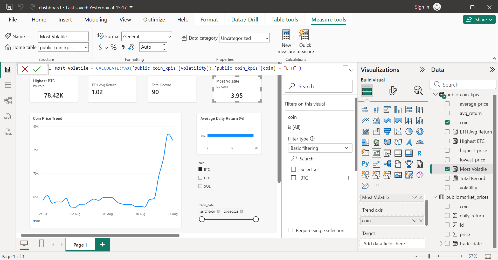

# Crypto Market Analytics

An end-to-end cryptocurrency analytics project that collects historical market data from CoinGecko, stores it in PostgreSQL, analyzes it with SQL, and visualizes interactive KPIs in Power BI.

## Dashboard Preview



## Tech Stack

- Python
- PostgreSQL
- SQL
- Pandas
- Power BI
- CoinGecko API

## Features

- Fetch 30-day historical prices for BTC, ETH, and SOL
- Calculate daily returns
- Store cleaned data in PostgreSQL
- Create analytical SQL views
- Interactive Power BI dashboard
- Coin and date filtering

## Database Schema

| Column | Type |
|---------|------|
| trade_date | DATE |
| coin | VARCHAR |
| price | NUMERIC |
| daily_return | NUMERIC |

## SQL Analytics

The project includes queries for:

- Average daily return
- Highest closing price
- Volatility (Standard Deviation)
- Price range
- KPI views

## ETL Pipeline

1. Fetch data from CoinGecko API
2. Transform with Pandas
3. Clean missing values
4. Load into PostgreSQL
5. Query with SQL
6. Visualize in Power BI

## Results

| KPI | Value |
|------|------:|
| Highest BTC Price | 78,424.62 |
| ETH Average Return | 1.02% |
| Most Volatile Asset | ETH |
| Records | 90 |

## How to Run

```bash
pip install -r requirements.txt
python python/load_data.py
```

Open the Power BI file:

```
powerbi/Crypto_Market_Analytics.pbix
```

## Author

Sharpmark
